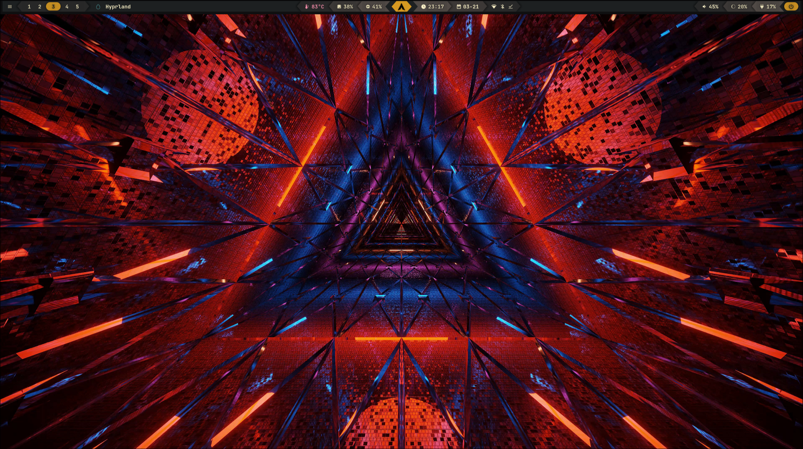
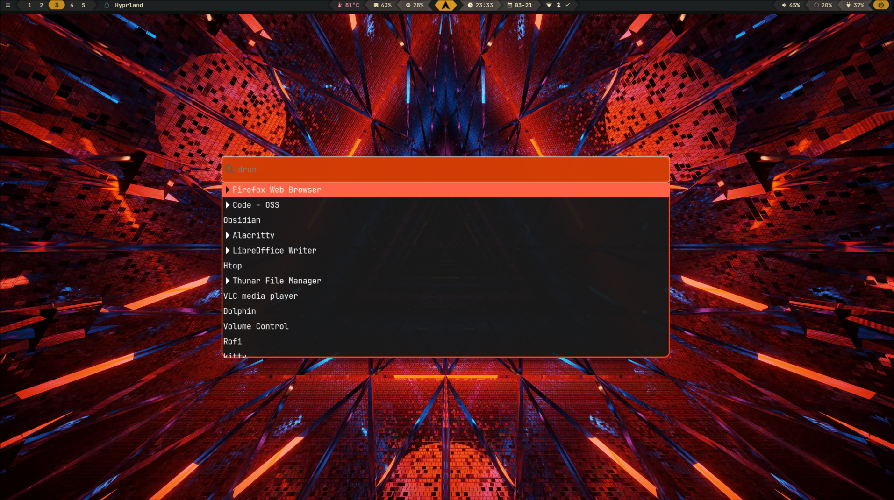
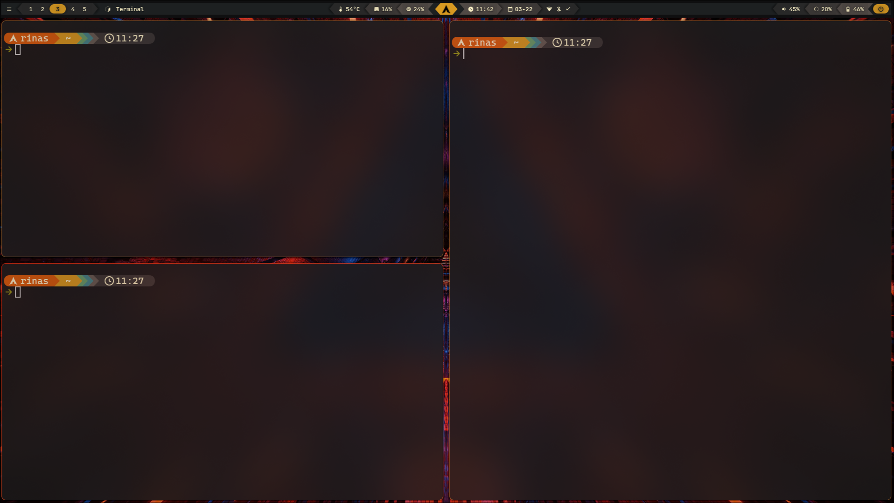

# Hyprland Configuration

This is my Hyprland configuration, including Waybar and Wofi.

## Screenshots

### Desktop


### Wofi


### Terminal


## Installation

To install this configuration, use the provided install script.

### Steps:
1. Clone this repository:
   ```sh
   git clone https://github.com/yourusername/hyprland-config.git
   cd hyprland-config
   ```
2. Make the install script executable:
   ```sh
   chmod +x install.sh
   ```
3. Run the install script:
   ```sh
   ./install.sh
   ```

The script will:
- Check and install required dependencies.
- Backup existing configurations to `~/.config/backup_YYYYMMDD_HHMMSS/`.
- Copy the new configuration files to `~/.config/`.
- Copy the wallpaper to `~/.config/hyprland/wallpapers/`.

## Dependencies

Ensure you have the following dependencies installed (the script will install them if missing):
- `starship`
- `wofi`
- `waybar`
- `hyprpaper`
- `hyprlock`
- `hypridle`
- `hyprshot`

## Reference
The Waybar configuration was adapted from [MechaBar](https://github.com/sejjy/mechabar.git).

